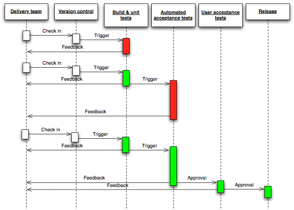
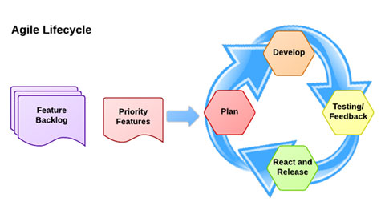
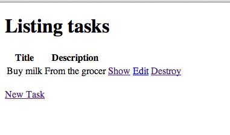
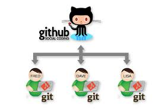
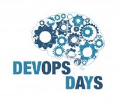

# Continous Delivery:
# Reliable software development through automation

## Jesse Szwedko
## j.szwedko@modcloth.com
## @jesse.szwedko

# 

---

# Continuous Delivery

_Continuous Delivery (CD) is a design practice used in software development to automate and improve the process of software delivery._ - Wikipedia

# Presenter Notes
- Anytime you are doing something manual, automate it
- Rule of 3s

---

---

# Agile

## 7 - 30 days
## Continuous feedback

# Presenter Notes
- Waterfall is "similar" just with a longer timeline
- Flikr deploys 10 times a day

---

# Outline

## Process Evolution

- Cowboy coding
- Version control
- Local development
- Automated deploys
- Testing
- Automated testing

## Complete example

---

# Tasks Application

Allow the user to create ToDos

- Create
- Read
- Update
- Delete
- List

# Presenter Notes
- Simple CRUD application
- Focus on process
- Show running live

---

# Technology

# Presenter Notes
- Focus is on process, not technology
- Please ask any technology questions

---

# Feature request: As a user, I should be able to add a description for each todo

---

# Cowboy Coding

---

---

# Do it live example

# Presenter Notes
- Add feature on remote box
- Make syntax error
- Revert to working version manually
- Show broken site (motivate version control and developing locally)
- Branch: initial-implementation

---

# Disadvantages

- Broken code is immediately visible to end user
- Can not debug code (reveal application secrets)
- End user sees a lot of volatility
- Cannot easily undo changes

---

# Version control

Track changes to source code

Centralized

- CVS
- SVN
- Perforce

Decentralized

- Git
- Mercurial

# Presenter Notes
- See source code at any point in time
- Source code example (show commit, checkout of older version)

---

# 

# Presenter Notes
- Image from http://programmers.stackexchange.com/questions/35074/im-a-subversion-geek-why-should-i-consider-or-not-consider-mercurial-or-git-or
- Demonstrate commit and push to github

---

# Version control example

# Presenter Notes
- Demonstrate commit, log, revert, checkout
- Demonstrate needing to see current changes

---

# Advantages

- Can deploy code at any point in history (e.g. to revert bugs)
- Can see why changes were performed
- Allow for collaboration

# Presenter Notes
- Imagine collaborating on code

----

# Still, we need to develop in a way where we can experiment

---

# Develop locally

- Develop features, fix bugs, experiment locally
- Push changes to server only after you are done
- (optionally) Use Vagrant to spin up development environment similar to deployment server

# Presenter Notes
- Use vagrant to spin up machine similar to "production" (especially when on Windows)
- Will not quite be push button, but we will get there

---

# Feature request: As a user, I should be able to add a description for each todo

---

# Developing locally example

# Presenter Notes
- Develop adding of description text field
- Push to github (show on Github)
- `git pull` on server
- Broken because of data migration!
- Are not updating JSON builders

---

# Advantages

- Can develop feature in increments, deploy when finished
- Allows for debugging
- Experimentation

# Presenter Notes

---

---

# Closer, but multi-step deployments introduce risk

---

# Automated deployments

- Specify each step of the deploy as code
- Deterministic
- Idempotent
- Should be able to rollback

# Presenter Notes
- Rule of 3s

---

# Deployment tasks

- Copy code
- Migrate database
- Restart web server

---

# 

# Presenter Notes
- Automated deployment tool (primarily used for Ruby applications)

---

# Automated deployment example

# Presenter Notes
- Review capistrano configuration
- Delete app/current
- Deploy
- Motivate need for tests

---

# Advantages

- Eliminate risk of multi-step deployments
- Deploying to multiple servers
- Automation as documentation

---

---

# Automated Tests

- Describe what the code *should* do
- Catch regressions
- Force better design (TDD)

---

# Enter MiniTest

# Presenter Notes
- Testing framework
- Alternatives include RSpec, TestUnit

----

# Feature request: As a user, I should be able to add a description for each todo

# Presenter Notes

---

# MiniTest example

# Presenter notes
- Add description, but break title
- Add view spec for show template to assert fields
- Break test
- Fix test

---

# But what if we forget to run the tests?

---

---

# Continuous integration server

"Build" is triggered by commit or push to VCS

- Run set-up tasks
- Run tests
- _Build artifacts_

# Presenter Notes
- git log w/ branches ("alternative timelines")
- Branch
- Add .travis.yml
---

# Feature request: As a user, I should be able to add a description for each todo

---

# CI Example (full example)

# Presenter Notes
- Create branch
- Add description
- Run tests
- Push to github
- Wait for Travis
- Merge
- Deploy

---

# Advantages

- Running tests happens automatically (you can trust other pull requests)
- Running application under many different environments
- Kick off longer test runs in the background

---

# Conclusion

---

# Mistakes we knew we were making
- Skipped infrastructure configuration
- You should try to avoid "building" on the server
    - E.g. we did asset compilation
- You should have a test stage target for deployment that is identical to production
    - Some issues are environment specific

---

# Questions

## Jesse Szwedko
## j.szwedko@modcloth.com
## @jesse.szwedko

# 

---

# [Devops Days](http://devopsdays.org/events/2014-pittsburgh/)

